# 🩸 RakthSetu

<div align="center">

[](https://github.com/rithin-rajpoot/rakthsetu)
[](LICENSE)
[](package.json)
[](https://github.com/rithin-rajpoot/rakthsetu/graphs/contributors)

### **Connecting Hearts, Saving Lives Through Technology** ❤️

*A revolutionary real-time blood donation platform that bridges the gap between donors and seekers with cutting-edge geospatial technology*

[🚀 **Live Demo**](https://rakthsetu.vercel.app) • [📖 **Documentation**](https://docs.rakthsetu.com) • [🐛 **Report Bug**](https://github.com/rithin-rajpoot/rakthsetu/issues) • [✨ **Request Feature**](https://github.com/rithin-rajpoot/rakthsetu/issues)

</div>

### **🚀 Try It Now!**

**Experience RakthSetu live at:** [https://rakthsetu-v1.vercel.app/](https://rakthsetu-v1.vercel.app/)

*No setup required - start saving lives immediately!*

---

## 🎯 **What is RakthSetu?**

> **RakthSetu** (*रक्तसेतु* - Bridge of Blood) is a next-generation web application that revolutionizes blood donation by connecting donors and seekers in real-time. Built with modern technologies, it provides instant matching, interactive mapping, and seamless communication to save precious lives.

<details>
<summary>🎥 <strong>See it in Action</strong></summary>

```
🔴 Emergency Blood Request Created
    ↓
⚡ Real-time Matching Algorithm
    ↓
📍 Nearby Donors Notified
    ↓
🗺️ Interactive Route Mapping
    ↓
❤️ Life Saved!
```

</details>

---

## ✨ **Key Features**

<table>
<tr>
<td width="50%">

### 🔄 **Smart Dual Role System**
- **Donor Mode**: Discover & respond to blood requests
- **Seeker Mode**: Create requests & find donors
- **Instant Role Switching**: Seamless mode transitions

</td>
<td width="50%">

### 🗺️ **Advanced Location Services**
- **10km Radius Matching**: Precise geospatial queries
- **Interactive Maps**: Real-time route visualization
- **Auto Geocoding**: Convert addresses to coordinates

</td>
</tr>
<tr>
<td>

### ⚡ **Real-time Communication**
- **Socket.IO**: Instant notifications & updates
- **Live Status**: Real-time request status changes
- **Interactive Routes**: Live navigation assistance

</td>
<td>

### 🩸 **Smart Blood Management**
- **Multi-step Forms**: Detailed request creation
- **Urgency Levels**: Priority-based categorization
- **Blood Compatibility**: Intelligent type matching

</td>
</tr>
</table>

---

## 🏗️ **Tech Stack**

<div align="center">

### **Frontend Arsenal**


### **Backend Powerhouse**


### **Services & APIs**


</div>

---

## 🚀 **Quick Start**

### **Prerequisites**
```bash
Node.js ≥ 16.0.0
MongoDB (Local/Atlas)
Google Maps API Key
```

### **⚡ One-Command Setup**

<details>
<summary>🔧 <strong>Backend Setup</strong></summary>

```bash
# Clone & Navigate
git clone https://github.com/rithin-rajpoot/rakthsetu.git
cd rakthsetu/server

# Install Dependencies
npm install

# Environment Configuration
cat > .env << EOL
PORT=5000
MONGODB_URI=mongodb://localhost:27017/rakthsetu
JWT_SECRET=your_super_secure_jwt_secret_key
JWT_EXPIRATION=7d
CLIENT_URL=http://localhost:5173
EOL

# Start Development Server
npm run dev
```

</details>

<details>
<summary>⚡ <strong>Frontend Setup</strong></summary>

```bash
# Navigate to Frontend
cd ../client

# Install Dependencies
npm install

# Environment Configuration
cat > .env << EOL
VITE_API_URL=http://localhost:5000
VITE_GOOGLE_MAPS_API_KEY=your_google_maps_api_key
EOL

# Launch Application
npm run dev
```

</details>

### **🌐 Access Points**
- **Frontend**: [http://localhost:5173](http://localhost:5173)
- **Backend API**: [http://localhost:5000](http://localhost:5000)

---

## 📱 **User Journey**

```mermaid
graph TD
    A[👤 User Registration] --> B{🔄 Choose Role}
    B -->|💉 Donor| C[🔍 Browse Requests]
    B -->|🆘 Seeker| D[📝 Create Request]
    C --> E[✅ Respond to Request]
    D --> F[⏳ Wait for Donors]
    E --> G[🗺️ Navigate via Map]
    F --> G
    G --> H[❤️ Successful Donation]
```

<div align="center">



</div>

### **🩸 As a Blood Seeker**
```
1️⃣ Switch to Seeker Mode
2️⃣ Create Blood Request (Multi-step Form)
3️⃣ Set Urgency Level & Location
4️⃣ Wait for Donor Responses
5️⃣ Navigate using Interactive Map
```

### **❤️ As a Blood Donor**
```
1️⃣ Switch to Donor Mode
2️⃣ Browse Nearby Requests
3️⃣ Respond to Matching Requests
4️⃣ Use Real-time Navigation
5️⃣ Save Lives! 🎉
```

---

## 🔌 **API Reference**

<details>
<summary>🔐 <strong>Authentication Endpoints</strong></summary>

| Method | Endpoint | Description |
|--------|----------|-------------|
| `POST` | `/rakthsetu/user/signup` | User registration |
| `POST` | `/rakthsetu/user/login` | User authentication |
| `POST` | `/rakthsetu/user/logout` | Session termination |
| `GET` | `/rakthsetu/user/profile` | User profile data |

</details>

<details>
<summary>🩸 <strong>Blood Request Endpoints</strong></summary>

| Method | Endpoint | Description |
|--------|----------|-------------|
| `POST` | `/rakthsetu/request/create` | Create blood request |
| `GET` | `/rakthsetu/request/all` | Get nearby requests |
| `DELETE` | `/rakthsetu/request/:id` | Delete request |
| `POST` | `/rakthsetu/request/:id/respond` | Respond to request |

</details>

### **📝 Example Request**
```javascript
// Create Blood Request
POST /rakthsetu/request/create
{
  "fullName": "John Doe",
  "location": "Hyderabad, India",
  "bloodType": "O+",
  "urgency": "Urgent"
}

// Response
{
  "success": true,
  "message": "Blood request created successfully",
  "responseData": {
    "status": "Matched",
    "matchedDonors": [...],
    "newBloodRequest": {...}
  }
}
```

---

## 🏗️ **Architecture Overview**

<details>
<summary>📂 <strong>Project Structure</strong></summary>

```
rakthsetu/
├── 🎨 client/                 # React Frontend
│   ├── src/
│   │   ├── 📄 pages/          # Route Components
│   │   │   ├── auth/          # Authentication
│   │   │   ├── home/          # Dashboard
│   │   │   ├── map/           # Interactive Maps
│   │   │   └── request/       # Blood Requests
│   │   ├── 🗄️ store/          # Redux Store
│   │   │   └── slice/         # State Slices
│   │   └── 🧩 components/     # Reusable Components
│   └── 📦 package.json
├── ⚙️ server/                 # Node.js Backend
│   ├── 🎛️ controllers/        # Business Logic
│   ├── 📊 models/             # Database Schemas
│   ├── 🛣️ routes/             # API Routes
│   ├── 🔒 middlewares/        # Authentication
│   ├── 🔌 socket/             # Real-time Events
│   └── 🛠️ utils/              # Helper Functions
└── 📖 README.md
```

</details>

---

## 🔧 **Advanced Features**

### **🗺️ Geospatial Intelligence**
- **MongoDB 2dsphere Indexing** for lightning-fast location queries
- **Radius-based Matching** within 10km for optimal response times
- **Real-time Coordinate Conversion** from human-readable addresses

### **🔐 Security First**
- **JWT Authentication** with secure HTTP-only cookies
- **Bcrypt Password Hashing** with salt rounds
- **Joi Input Validation** for data integrity
- **Protected Route Middleware** for access control

### **⚡ Real-time Magic**
- **Socket.IO Events** for instant notifications
- **Live User Session Management**
- **Synchronized Map Updates** between users

---

## 📈 **Roadmap & Future Vision**

<div align="center">

### **🛣️ Coming Soon**

| Phase | Feature | Status |
|-------|---------|--------|
| **Phase 1** | 📱 React Native Mobile App | `Planning` |
| **Phase 2** | 📱 SMS Notifications (Twilio) | `Design` |
| **Phase 3** | 🏥 Blood Bank Integration | `Research` |
| **Phase 4** | 🔍 Advanced Filtering System | `Backlog` |
| **Phase 5** | 🚨 Emergency Priority Mode | `Concept` |
| **Phase 6** | 🌍 Multi-language Support | `Future` |

</div>

---

## 🤝 **Contributing**

We welcome contributions! Here's how you can help:

### **🚀 Getting Started**
1. **Fork** the repository
2. **Create** feature branch: `git checkout -b feature/AmazingFeature`
3. **Commit** changes: `git commit -m '✨ Add AmazingFeature'`
4. **Push** to branch: `git push origin feature/AmazingFeature`
5. **Open** a Pull Request

### **📝 Contribution Guidelines**
- Follow existing code style
- Add tests for new features
- Update documentation
- Use conventional commits

---

## 👥 **Our Amazing Team**

<div align="center">

| Role | Name | GitHub |
|------|------|--------|
| **🚀 Backend Developer** | AdarshChary | [@adarshchary](https://github.com/M-ADARSHCHARY) |
| **📊 Frontend Developer** | Rithin Rajpoot | [@rithin-rajpoot](https://github.com/rithin-rajpoot) |
| **⚙️ External API Integration** | Abhishek | [@Abhi5hek-20](https://github.com/Abhi5hek-20) |

*Special thanks to all contributors who make this project possible!*

</div>

---

## 📄 **License**

<div align="center">

This project is licensed under the **ISC License**. See [LICENSE](LICENSE) file for details.

---

## 🙏 **Acknowledgments**

**🎉 Powered by incredible open-source technologies:**

- **Google Maps API** - For world-class mapping services
- **MongoDB** - For robust geospatial database capabilities  
- **Socket.IO** - For seamless real-time communication
- **React & Redux** - For amazing frontend development experience

---

## 📞 **Support & Community**

<div align="center">

**Need help? We're here for you!**

[](https://github.com/rithin-rajpoot/rakthsetu/issues)
[](mailto:support@rakthsetu.com)

### **💬 Join the Community**
[](https://discord.gg/rakthsetu)
[](https://twitter.com/rakthsetu)

</div>

---

<div align="center">

### **🩸 Save Lives, Donate Blood! ❤️**

**RakthSetu - Connecting hearts, saving lives through technology.**

*Made with ❤️ for humanity*

---

[](https://github.com/rithin-rajpoot/rakthsetu/stargazers)
[](https://github.com/rithin-rajpoot/rakthsetu/network/members)
[](https://github.com/rithin-rajpoot/rakthsetu/watchers)

</div>

</div>
